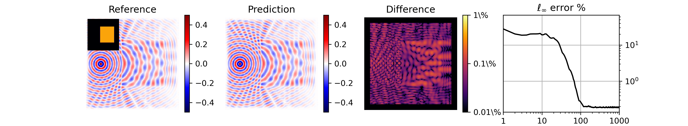
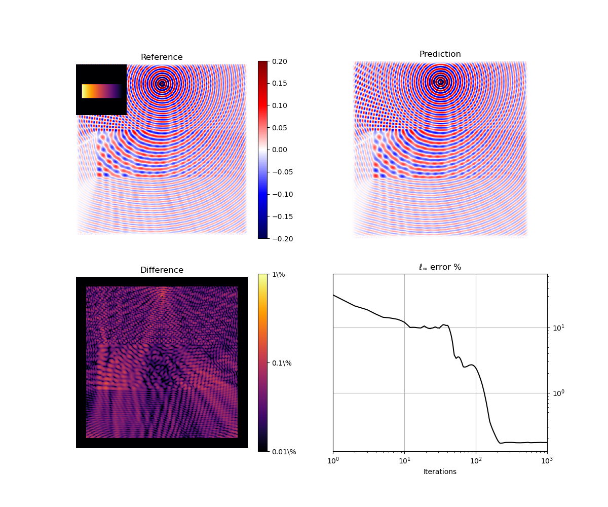

<h1 align="center">A Helmholtz equation solver using unsupervised learning <a href="https://www.sciencedirect.com/science/article/pii/S0021999121003259" class="button big">[Paper]</a></h1>




> Deep-learning based iterative solver for the heterogeneous Helmholtz equation in 2D using a fully-learned optimizer. The lightweight network architecture is based on a modified UNet that includes a learned hidden state. The network is trained using a physics-based loss function and a set of idealized sound speed distributions with fully unsupervised training (no knowledge of the true solution is required).

# Installation

Clone the repo in a local folder. Create an environment containing [PyTorch](https://pytorch.org/), [PyTorch Ligthning](https://github.com/PyTorchLightning/pytorch-lightning) and various other libraries. If you don't want to install them by yourself, you can create such environment in anaconda using

```bash
conda env create -f environment.yml
```
However, you must obtain a copy of [kWave](http://www.k-wave.org/) and MATLAB by yourself. Depending on where k-Wave is installed, you may have to change some paths in some `m` files in the `matlab` folder.

To install the package use

```bash
pip install .
```

### Datasets
The dataset used in the paper can be downloaded [from this Google Drive link](https://drive.google.com/file/d/1H8wbS4D0WAGIRoj3SSlmarl_C3N0ZTNz/view?usp=sharing). The downloaded zip file needs to be extracted in the root folder of the repository. This dataset only have speed of sound maps in it.

For supervised learning, another dataset with pre-computed wavefields and denser sampling can be downloaded [from this repository from Son Hai Nguyen](https://sc-nas.fit.vutbr.cz:10443/xnguye16/ssw-dataset).

# Example

```python
from helmnet import IterativeSolver
from helmnet.support_functions import fig_generic
import numpy as np
import torch

solver = IterativeSolver.load_from_checkpoint(
    "checkpoints/trained_weights.ckpt", strict=False
)
solver.freeze()  # To evaluate the model without changing it
solver.to("cuda:0")

# Setup problem
source_location = [30, 128]
sos_map = np.ones((256, 256))
sos_map[100:170, 30:240] = np.tile(np.linspace(2,1,210),(70,1))

# Set model domain size (assumed square)
solver.set_domain_size(sos_map.shape[-1], source_location=source_location)

# Run example in kWave and pytorch, and produce figure
fig_generic(
    solver,
    sos_map,
    path="images/custom",
    source_location=source_location,
    omega=1,
    min_sos=1,
    cfl=0.1,
    roundtrips=10.0,
    mode="normal",
)
```

The model results are compared against k-Wave with the given CFL and rountrips parameters



# Reproduce paper figures

To get the kWave and GMRES results on the test set you should
1. run `parallel_sectral_gmres_solver.m`
2. run `parallel_kwave_solver.m`

To get the model results on the test set run

`python evaluate.py`

All the figures can then be generated using

`python produce_figures.py`

For the real skull example, you'll need the file `qure_ai-CQ500CT2-Unknown Study-CT0.625mm-CT000112.dcm` from the [qure.ai](http://headctstudy.qure.ai/) dataset in the `examples` folder.

# Citing

```
@article{stanziola2021helmholtz,
    title = {A Helmholtz equation solver using unsupervised learning: Application to transcranial ultrasound},
    author = {Antonio Stanziola and Simon R. Arridge and Ben T. Cox and Bradley E. Treeby},
    journal = {Journal of Computational Physics},
    pages = {110430},
    year = {2021},
    issn = {0021-9991},
    doi = {https://doi.org/10.1016/j.jcp.2021.110430},
    url = {https://www.sciencedirect.com/science/article/pii/S0021999121003259}
}
```