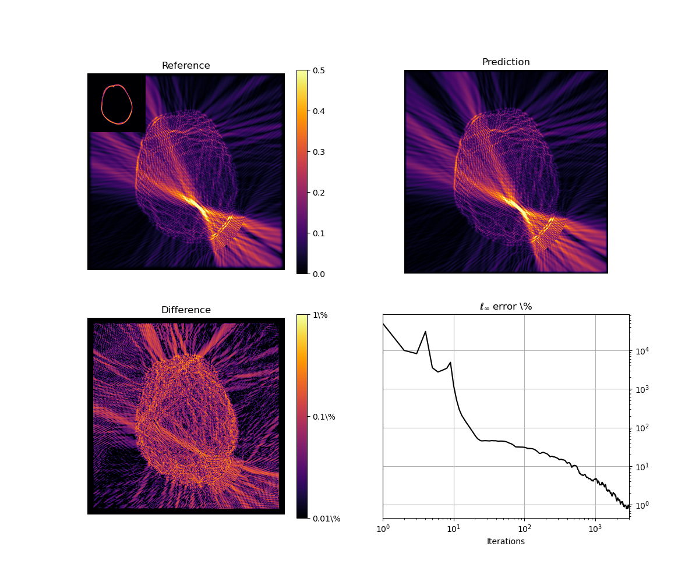

<div style="text-align: justify">
Transcranial ultrasound therapy is increasingly used for the non-invasive treatment of brain disorders. However, conventional numerical wave solvers are currently too computationally expensive to be used online during treatments to predict the acoustic field passing through the skull (e.g., to account for subject-specific dose and targeting variations). As a step towards real-time predictions, in the current work, a fast iterative solver for the heterogeneous Helmholtz equation in 2D is developed using a fully-learned optimizer. The lightweight network architecture is based on a modified UNet that includes a learned hidden state. The network is trained using a physics-based loss function and a set of idealized sound speed distributions with fully unsupervised training (no knowledge of the true solution is required). The learned optimizer shows excellent performance on the test set, and is capable of generalization well outside the training examples, including to much larger computational domains, and more complex source and sound speed distributions, for example, those derived from x-ray computed tomography images of the skull.
</div>

## Learned iterative solver
---
Given an invertible linear operator $A$, in our case the Helmholtz operator, and a source term $\rho$, our goal is to find a $u$ such that $Au = \rho$.

The learned iterative solver updates the current estimate of the wavefield $u_k$ as 

$$
u_{k+1} = u_k + f_\theta(u_k, c, \rho)
$$

Where $f_\theta$ is a learned function. To leverage the knowledge of the forward operator $A$, the learned function is defined as

$$
u_{k+1} = u_k + f_\theta(u_k, e_k), \qquad e_k = A(c)u_k - \rho
$$

The learned solver is implemented as a lightweight UNet, trained by minimizing the residual error. Because we aim to train on small examples but evaluate on larger domains, all layers are fully convolutionals.

## Results
---


The learned solver outperforms GMRES in terms of speed, calculated as the time to reach an $\ell_\infty$ error of 1%. Preconditioning can be included by modifying the forward operator $A$, but this is not implemented in this work.

### Generalization
The learned operator can generalize to larger domain sizes, as well as to more complex source and sound speed distributions. For example, the learned solver can be used to predict the acoustic field in the brain, where the speed of sound is derived from a computed tomography image of the skull and the source is a focused bowl.




## Citing
```
@article{stanziola2021helmholtz,
    title = {A Helmholtz equation solver using unsupervised learning: Application to transcranial ultrasound},
    author = {Antonio Stanziola and Simon R. Arridge and Ben T. Cox and Bradley E. Treeby},
    journal = {Journal of Computational Physics},
    pages = {110430},
    year = {2021},
    issn = {0021-9991},
    doi = {https://doi.org/10.1016/j.jcp.2021.110430},
    url = {https://www.sciencedirect.com/science/article/pii/S0021999121003259}
}
```